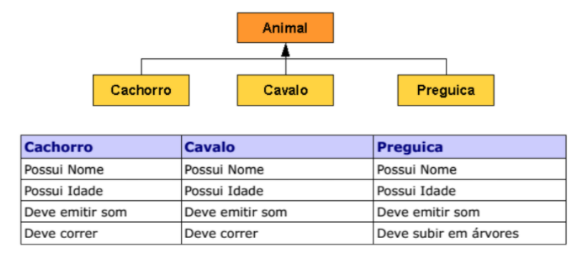

#Exercício 7

Crie uma hierarquia de classes conforme abaixo com os seguintes atributos e comportamentos (observe a tabela), 

Utilize os seus conhecimentos e distribua as características de forma que tudo o que for comum a todos os animais fique na classe Animal.

