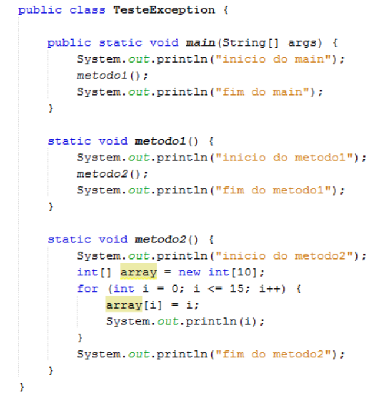
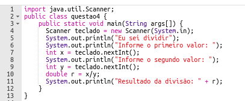

# Projeto referente aos exercícios 3 e 4

## Exercício 3:
O código abaixo lança uma exceção (propositalmente) e interrompe sua execução. 

Utilizando o tratamento de exceções, corrija a classe com o objetivo de não parar sua execução.

OBS:: A Exception lançada é ArrayIndexOutOfBoundsException.

## Exercício 4:
No código abaixo você deverá identificar as partes problemáticas do código e reescrever utilizando exceções. 
Ou seja, todas as partes devem ser identificadas e tratadas da forma adequada, neste exercício, significa alertar o usuário quanto ao problema. 

Entretanto, nesse programa a leitura dos valores deve ser feita, mesmo que para isso o usuário tenha que tentar informar várias vezes os valores na mesma execução do programa.

