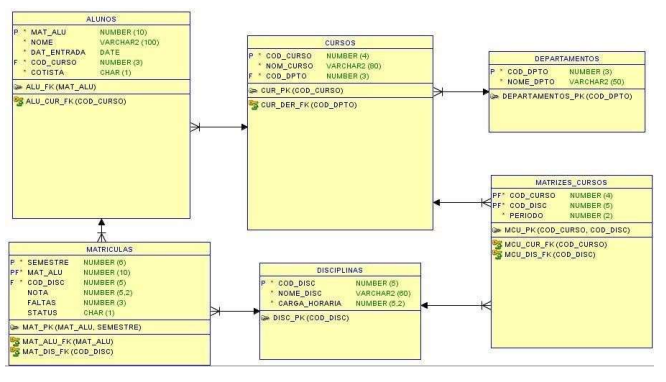

# Exercício 1

## Criação das Tabelas sem relacionamentos

Dado a modelagem que está em anexo, siga as instruções abaixo: 

1) Apenas definir as estruturas das tabelas;

2) Não precisa estruturar os relacionamentos;

3) Antes de realizar a criação das tabelas, criar um schema chamado "university" e associe cada tabela a esse schema;

4) Realizar pelo menos uma alteração no tipo dos dados da coluna de uma das tabelas. Exemplo: A coluna "X" era do tipo INTEGER e agora ela passa a ser do tipo VARCHAR.

Obs: Preste bem atenção nos tipos de dados e na nomenclatura das tabelas;

