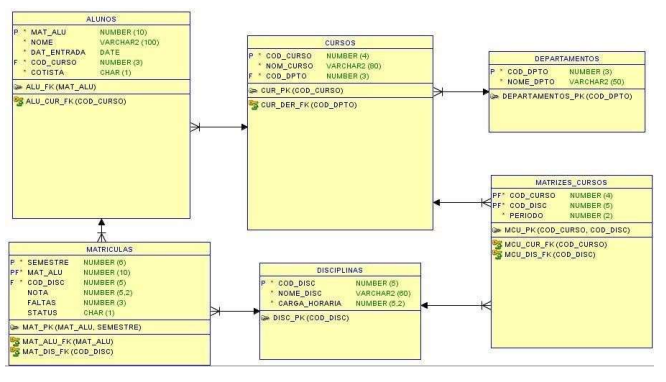

# Exercício 6

## Criação das Tabelas com relacionamentos

Dado a modelagem que está em anexo, siga as instruções abaixo: 

1) Definir as estruturas das tabelas;

2) Definir os relacionamento das tabelas;

3) Antes de realizar a criação das tabelas, criar um schema chamado "university" e associe cada tabela a esse schema;

